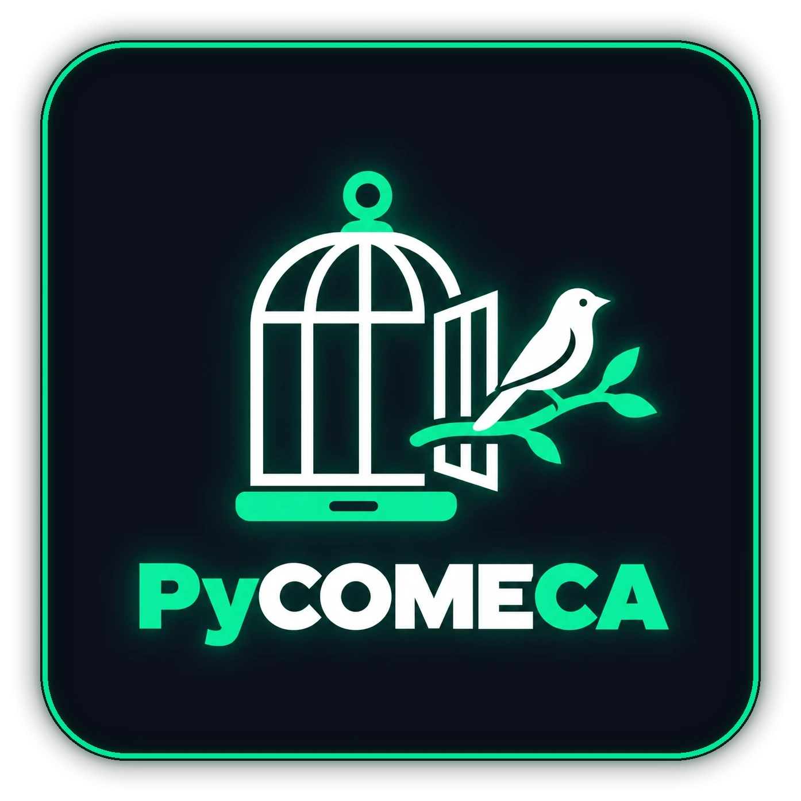

<p align="center"></p>

# PyCOMECA

🇮🇹 Italiano (questa pagina) · 🇬🇧 [English](README.md)

Aprire il portone di casa con un comando, senza passare dall'app ufficiale del videocitofono.

PyCOMECA è un client Python, senza dipendenze esterne, per i videocitofoni Comelit della famiglia ViP. Parla direttamente con il citofono sulla rete di casa (protocollo ICONA, porta 64100) oppure da fuori casa attraverso lo stesso percorso cloud P2P usato dall'app.

Il nome: **Py** come Python, **COME** da Comelit, **CA** da casa. Inizio e fine insieme fanno PYCA, che si legge come Pica, il cognome di chi lo ha scritto.

## Perché esiste

L'app ufficiale non offre un'azione rapida: per aprire il portone bisogna avviarla, aspettare la connessione e passare da più schermate. Io volevo un comando solo, da richiamare da un sistema domotico, da uno script o da un comando rapido del telefono. Non avendo trovato una via ufficiale, ho studiato come l'app parla con il citofono e ho riscritto quel dialogo in Python.

Il progetto raccoglie sia il codice sia gli appunti di studio: formato dei messaggi, sequenza di apertura, percorso remoto e metodo usato per arrivarci.

## Stato delle verifiche

| Funzione | Stato |
|---|---|
| Lettura configurazione e rubrica in rete locale | provata sull'impianto reale |
| Apertura portone in rete locale, con evento di conferma dal citofono | provata sull'impianto reale |
| Percorso remoto (OAuth, `p2p/start`, ICE, PseudoTCP): lettura configurazione | provata sull'impianto reale, anche forzando il relay pubblico |
| Percorso remoto da una rete diversa da quella di casa | non ancora provato |
| Apertura portone dal percorso remoto | non ancora provata |
| Ascolto continuo degli eventi (squillo), audio e video | non implementati |

I test automatici (37) girano senza citofono: usano un dispositivo simulato e dati fittizi.

## Dispositivi

| Dispositivo | Esito |
|---|---|
| Comelit Mini Wi-Fi **6741W** (modello interno `MSVF`, firmware 2.1.0), impianto SimpleBus2 | provato direttamente |
| Comelit **6701W** | non provato da me; il protocollo locale coincide con quello documentato dai progetti citati in fondo |

L'app usata come riferimento per lo studio è Comelit per Android, versione 7.5.0.

## Cosa serve

Vedi [docs/DATI.md](docs/DATI.md) per il dettaglio di ogni dato, il formato atteso e dove trovarlo. In breve:

- indirizzo IP del citofono in rete locale (solo per il percorso locale);
- **user-token** del citofono, 32 caratteri esadecimali;
- per il percorso remoto: credenziali dell'account Comelit e `deviceUuid` del citofono.

Tutti gli identificativi che compaiono in questo repository (indirizzi, token, UUID, IP, nomi) sono **inventati**, ma hanno la stessa forma di quelli reali.

## Uso

Serve Python 3.11 o successivo. Nessun pacchetto da installare.

Percorso locale, dalla rete di casa:

```bash
# crea il tuo file di configurazione dall'esempio, poi modificalo:
cp installation.example.json installation.local.json
# in installation.local.json sostituisci l'IP di esempio 192.168.1.50 con quello del tuo citofono

# il token di 32 cifre qui sotto e' fittizio: metti il tuo
export COMELIT_TOKEN=0123456789abcdef0123456789abcdef

python pycomeca_ctl.py --list
python pycomeca_ctl.py --open "Portone principale"
```

Percorso remoto, da qualsiasi rete (i valori qui sotto sono fittizi, metti i tuoi):

```bash
export COMELIT_USER=nome@example.com
export COMELIT_PASS=la-tua-password-comelit
export COMELIT_DEVICE_UUID=1a2b3c4d-5e6f-4a7b-8c9d-0e1f2a3b4c5d-00001
export COMELIT_TOKEN=0123456789abcdef0123456789abcdef

python -m pycomeca.remote --list
python -m pycomeca.remote --open "Portone principale"
```

`--relay-only` forza il passaggio dal relay pubblico anche quando si è in casa, utile per provare il percorso esterno. `--verbose` mostra la sequenza dei passaggi.

Nessun comando apre il portone se non c'è `--open`. Ogni sessione invia al massimo un comando di apertura e non lo ripete mai da sola.

Test:

```
python -m unittest discover -s tests
```

## Contenuto

- `pycomeca/` client locale: framing ICONA, canali, autenticazione, configurazione, apertura.
- `pycomeca/remote/` trasporto remoto: SDP, STUN, ICE, PseudoTCP, chiamate al cloud.
- `pycomeca_bridge.py` piccolo servizio HTTP locale (`POST /open`) da tenere dietro VPN.
- `relay/` alternativa senza cloud Comelit: una pagina PHP su hosting e un piccolo agente in casa che fa solo connessioni in uscita. Vedi [relay/README.md](relay/README.md).
- `tools/frida/` script usati per osservare l'app durante lo studio.
- `docs/` appunti: [protocollo](docs/PROTOCOL.md), [catalogo messaggi](docs/MESSAGGI.md), [videochiamata](docs/CHIAMATA.md), [app ufficiale](docs/APP_UFFICIALE.md), [percorso remoto](docs/REMOTE_P2P.md), [metodo di studio](docs/DEBUG_FLOW.md), [dati necessari](docs/DATI.md), [un tap da iPhone](docs/IPHONE.md).

## Avvertenze

- Progetto indipendente, non affiliato né approvato da Comelit Group. I marchi appartengono ai rispettivi proprietari.
- Pensato per l'uso sul proprio impianto. Non usarlo su impianti di cui non sei titolare o per cui non hai il permesso.
- Il user-token è statico e sul filo viaggia in chiaro: non esporre mai la porta 64100 su internet e non pubblicare catture di rete o copie del database dell'app.
- Il protocollo non è documentato dal produttore. Un aggiornamento del firmware o del cloud può far smettere di funzionare tutto senza preavviso.
- L'evento di conferma dice che il citofono ha eseguito il comando, non che la serratura si sia mossa: dipende dal cablaggio.

## Riconoscimenti

Lo studio del protocollo locale deve molto a lavori già pubblici: [comelit-client](https://github.com/madchicken/comelit-client) di Pierpaolo Follia, [ha-component-comelit-intercom](https://github.com/nicolas-fricke/ha-component-comelit-intercom) di Nicolas Fricke, gli articoli di [grdw](https://grdw.nl/2023/01/28/my-intercom-part-1.html) e le integrazioni per Home Assistant con riferimenti verificati su cattura per il 6701W. La parte sul percorso remoto P2P è frutto dello studio descritto in questo repository.

## Licenza

[AGPL-3.0](LICENSE). Copyright (C) 2026 davidebr90.
